<!-- ## 現在のシステムはどうなっているか、確認手順 -->
<!-- `systemd`のステータスを確認する
```bash
systemctl --user status ibus.service
systemctl --user status fcitx.service
```
デーモン起動してない場合は以下。
```bash
ps aux | grep ibus
ps aux | grep fcitx
```
実際のシステムの様子
```bash
$ systemctl --user status ibus.service
Unit ibus.service could not be found.
$ systemctl --user status fcitx
Unit fcitx.service could not be found.
$ ps aux | grep ibus
**user**       2813  0.0  0.0   2892  1536 ?        Ss   07:08   0:00 sh -c /usr/bin/ibus-daemon --panel disable $([ "$XDG_SESSION_TYPE" = "x11" ] && echo "--xim")
**user**       2816  0.0  0.0 316488 11900 ?        Sl   07:08   0:00 /usr/bin/ibus-daemon --panel disable --xim
**user**       2879  0.0  0.0 164828  7424 ?        Sl   07:08   0:00 /usr/libexec/ibus-memconf
**user**       2884  0.0  0.0 274252 29996 ?        Sl   07:08   0:01 /usr/libexec/ibus-extension-gtk3
**user**       2893  0.0  0.0 195856 24752 ?        Sl   07:08   0:00 /usr/libexec/ibus-x11 --kill-daemon
**user**       2906  0.0  0.0 238844  7680 ?        Sl   07:08   0:01 /usr/libexec/ibus-portal
**user**       3295  0.0  0.0 164828  7424 ?        Sl   07:08   0:00 /usr/libexec/ibus-engine-simple
**user**       5837  0.0  0.0 313212 12160 ?        Sl   07:08   0:00 /usr/lib/ibus-mozc/ibus-engine-mozc --ibus
**user**      20548  0.0  0.0  10272  2432 pts/0    S+   14:10   0:00 grep --color=auto ibus
$ ps aux | grep fcitx
**user**       2952  0.0  0.1 437000 54968 ?        S    07:08   0:19 fcitx
**user**       3031  0.0  0.0   8832  3468 ?        Ss   07:08   0:03 /usr/bin/dbus-daemon --syslog --fork --print-pid 5 --print-address 7 --config-file /usr/share/fcitx/dbus/daemon.conf
**user**       3067  0.0  0.0   6580  1284 ?        SN   07:08   0:00 /usr/bin/fcitx-dbus-watcher unix:abstract=/tmp/dbus-4Ni6lT2a6h,guid=51d3f5057e0dc44275ba286a664a785a 3031
**user**      20571  0.0  0.0  10272  2432 pts/0    S+   14:12   0:00 grep --color=auto fcitx

```

- **IBus デーモンが実行中**：`ibus-daemon`が `--panel disable --xim` オプションを付けて実行中。これは、X Input Method (XIM) サポートを有効にして、パネル (GUIの一部) を無効にする設定。
- **複数のIBus関連プロセスがアクティブ**：`ibus-memconf`, `ibus-extension-gtk3`, `ibus-x11`, `ibus-portal`, `ibus-engine-simple` および `ibus-engine-mozc` など、複数のIBus関連プロセスがシステム上で稼働

- **Fcitx メインプロセスが実行中**：`fcitx` プロセス→Fcitxのメイン入力メソッドフレームワーク
- **FcitxのD-Bus設定**：`/usr/bin/dbus-daemon` がFcitx専用のD-Busデーモンとして実行されてる。この設定は、Fcitxが独自のD-Bus接続を通じて他のアプリケーションと通信できるようにするためのもの。 -->

<!-- `im-config -a`
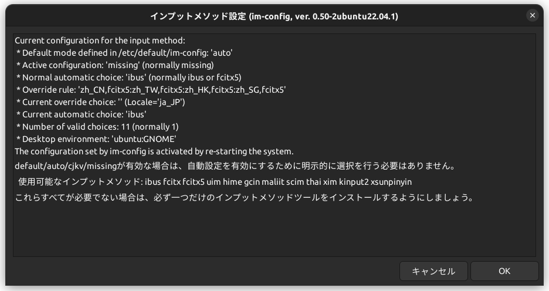
> Current configuration for the input method:
>  * Default mode defined in /etc/default/im-config: 'auto'
>  * Active configuration: 'missing' (normally missing)
>  * Normal automatic choice: 'ibus' (normally ibus or fcitx5)
>  * Override rule: 'zh_CN,fcitx5:zh_TW,fcitx5:zh_HK,fcitx5:zh_SG,fcitx5'
>  * Current override choice: '' (Locale='ja_JP')
>  * Current automatic choice: 'ibus'
>  * Number of valid choices: 11 (normally 1)
>  * Desktop environment: 'ubuntu:GNOME'
> The configuration set by im-config is activated by re-starting the system.
> default/auto/cjkv/missingが有効な場合は、自動設定を有効にするために明示的に選択を行う必要はありません。
>   使用可能なインプットメソッド: ibus fcitx fcitx5 uim hime gcin maliit scim thai xim kinput2 xsunpinyin
> これらすべてが必要でない場合は、必ず一つだけのインプットメソッドツールをインストールするようにしましょう。

```bash
$ im-config -l
 ibus fcitx xim
```
`synaptic`で確認したところ、`xim`はインストールされていないんだが…🤔
```bash
im-config -o
/usr/bin/im-config: 88: .: cannot open /usr/share/im-config/data/??_.conf: No such file
``` -->

<!-- 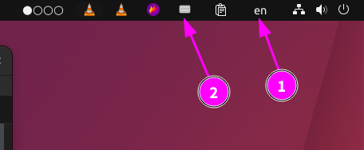
①はiBus、②はFcitxが表示されている。 -->

<!-- 現状、`.xinputrc`ファイルは存在しない。
`im-config`コマンドを用いてインプットメソッドを指定した場合のみ、`.xinputrc`ファイルが作成され、そこに記述される。 -->

<!-- ## fcitxの削除
このような状況なので、fcitxをアンインストールすることにした。 -->
<!-- ```bash
# fcitxを含むパッケージを確認
apt list --installed | grep fcitx
fcitx-bin/jammy,now 1:4.2.9.8-5 amd64 [インストール済み、自動]
fcitx-config-common/jammy,jammy,now 0.4.10-3 all [インストール済み、自動]
fcitx-config-gtk/jammy,now 0.4.10-3 amd64 [インストール済み]
fcitx-data/jammy,jammy,now 1:4.2.9.8-5 all [インストール済み、自動]
fcitx-frontend-all/jammy,jammy,now 1:4.2.9.8-5 all [インストール済み、自動]
fcitx-frontend-gtk2/jammy,now 1:4.2.9.8-5 amd64 [インストール済み、自動]
fcitx-frontend-gtk3/jammy,now 1:4.2.9.8-5 amd64 [インストール済み、自動]
fcitx-frontend-qt5/jammy,now 1.2.7-1.2build1 amd64 [インストール済み、自動]
fcitx-module-dbus/jammy,now 1:4.2.9.8-5 amd64 [インストール済み、自動]
fcitx-module-kimpanel/jammy,now 1:4.2.9.8-5 amd64 [インストール済み、自動]
fcitx-module-lua/jammy,now 1:4.2.9.8-5 amd64 [インストール済み、自動]
fcitx-module-quickphrase-editor5/jammy,now 1.2.7-1.2build1 amd64 [インストール済み、自動]
fcitx-module-x11/jammy,now 1:4.2.9.8-5 amd64 [インストール済み、自動]
fcitx-modules/jammy,now 1:4.2.9.8-5 amd64 [インストール済み、自動]
fcitx-mozc-data/jammy,jammy,now 2.26.4220.100+dfsg-5.2 all [インストール済み、自動]
fcitx-mozc/jammy,now 2.26.4220.100+dfsg-5.2 amd64 [インストール済み]
fcitx-pinyin/jammy,now 1:4.2.9.8-5 amd64 [インストール済み、自動]
fcitx-table-emoji/jammy,jammy,now 0.2.4-2 all [インストール済み]
fcitx-table/jammy,now 1:4.2.9.8-5 amd64 [インストール済み、自動]
fcitx-tools/jammy,now 1:4.2.9.8-5 amd64 [インストール済み]
fcitx-ui-classic/jammy,now 1:4.2.9.8-5 amd64 [インストール済み、自動]
fcitx/jammy,jammy,now 1:4.2.9.8-5 all [インストール済み]
libfcitx-config4/jammy,now 1:4.2.9.8-5 amd64 [インストール済み、自動]
libfcitx-core0/jammy,now 1:4.2.9.8-5 amd64 [インストール済み、自動]
libfcitx-gclient1/jammy,now 1:4.2.9.8-5 amd64 [インストール済み、自動]
libfcitx-qt5-1/jammy,now 1.2.7-1.2build1 amd64 [インストール済み、自動]
libfcitx-qt5-data/jammy,jammy,now 1.2.7-1.2build1 all [インストール済み、自動]
libfcitx-utils0/jammy,now 1:4.2.9.8-5 amd64 [インストール済み、自動]
```
- 事前にfcitx-mozcのユーザー辞書をエクスポートしておく
- `.bashrc`, `.xprofile`を書き換えておく
```diff
- export GTK_IM_MODULE=fcitx
- export QT_IM_MODULE=fcitx
- export XMODIFIERS=@im=fcitx
+ export GTK_IM_MODULE=ibus
+ export QT_IM_MODULE=ibus
+ export XMODIFIERS=@im=ibus
```

```bash
# fcitxに関連するパッケージをremove
sudo apt-get remove fcitx*

以下のパッケージは「削除」されます:
  fcitx fcitx-bin fcitx-config-common fcitx-config-gtk fcitx-data fcitx-frontend-all fcitx-frontend-gtk2 fcitx-frontend-gtk3 fcitx-frontend-qt5
  fcitx-module-dbus fcitx-module-kimpanel fcitx-module-lua fcitx-module-quickphrase-editor5 fcitx-module-x11 fcitx-modules fcitx-mozc
  fcitx-mozc-data fcitx-pinyin fcitx-table fcitx-table-emoji fcitx-tools fcitx-ui-classic
アップグレード: 0 個、新規インストール: 0 個、削除: 22 個、保留: 3 個。
この操作後に 17.7 MB のディスク容量が解放されます。
続行しますか? [Y/n] 
## 削除処理出力

im-config -l
 ibus xim
# ibusをinput methodに指定
im-config -n ibus

# 再起動
```
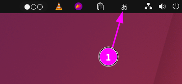
fcitxのトレイアイコンが消えた。 -->

<!-- `ibus-setup`にてibus全般のセットアップを行う。
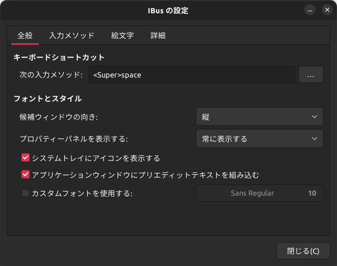 -->

<!-- ### ibusの足りない機能
1. 入力メソッドの切り替えショートカットが1種類しかな
   1. 異なるキーにen⇔jaが切り替えられない
2. クリップボード機能が使えない
   1. fcitxでは拡張機能としてクリップボード機能が存在した

1に関しては、GNOMEのキーボード・ショートカット割当機能にて実装が可能です。
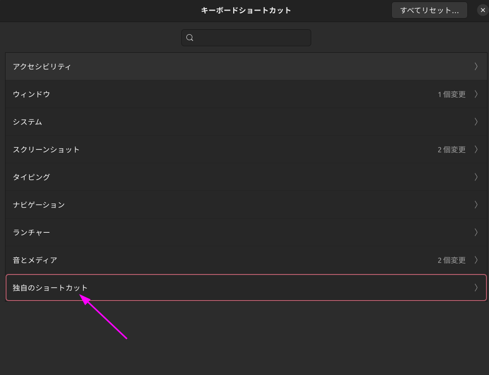
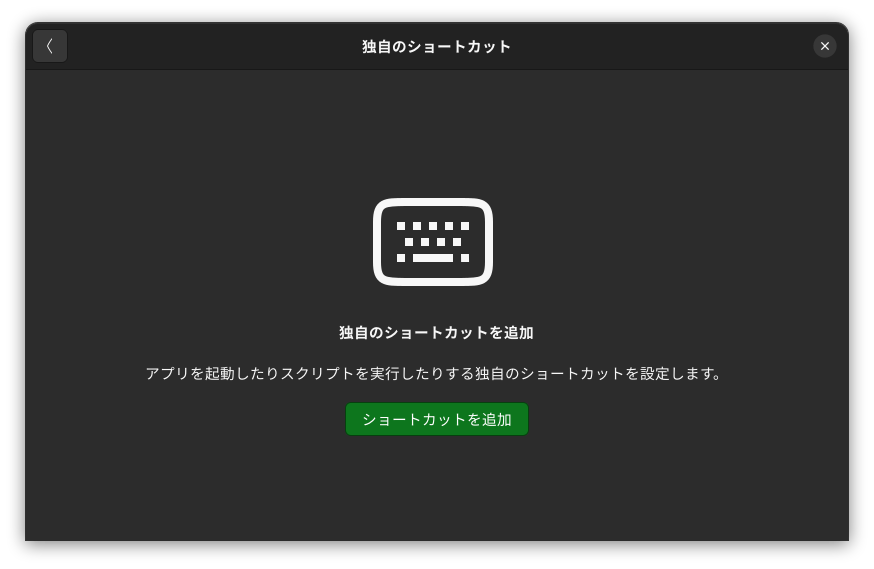

- 直接入力に切り替えるスクリプト
```bash:直接入力に切り替えるスクリプトswitch_to_english.sh
#!/bin/bash
ibus engine xkb:us::eng
```
```bash:日本語へ切り替えるスクリプトswitch_to_japanese.sh
#!/bin/bash
ibus engine mozc-jp
```
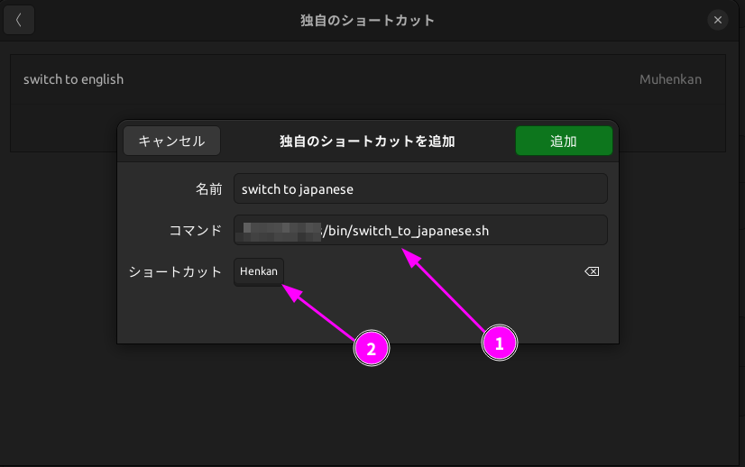
これにより、無変換キーで直接入力、変換キーで日本語入力を実現できます。
しかしながらシステムトレイの表示が切り替わりません。
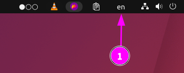
これについては解決法が見つかりませんでした。（あまり困りませんが）
また、入力モードは以下のようにしておく必要があります。
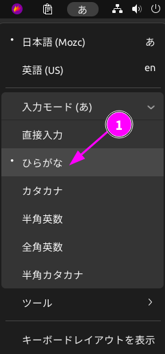 -->


### kdenlive
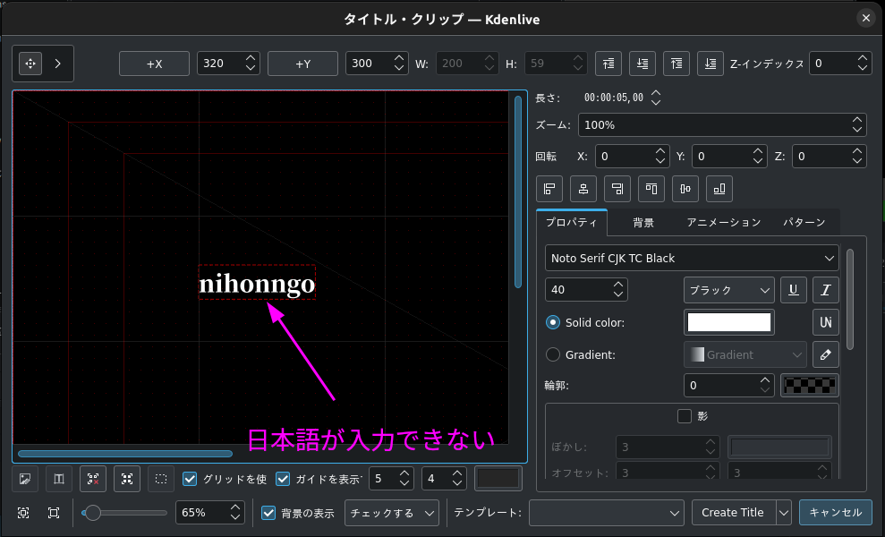
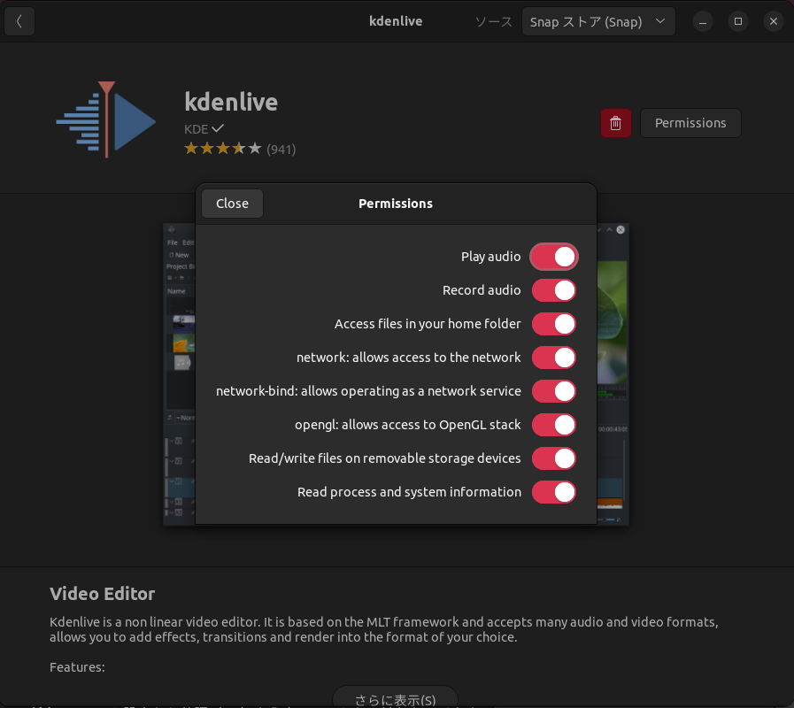


### Blender
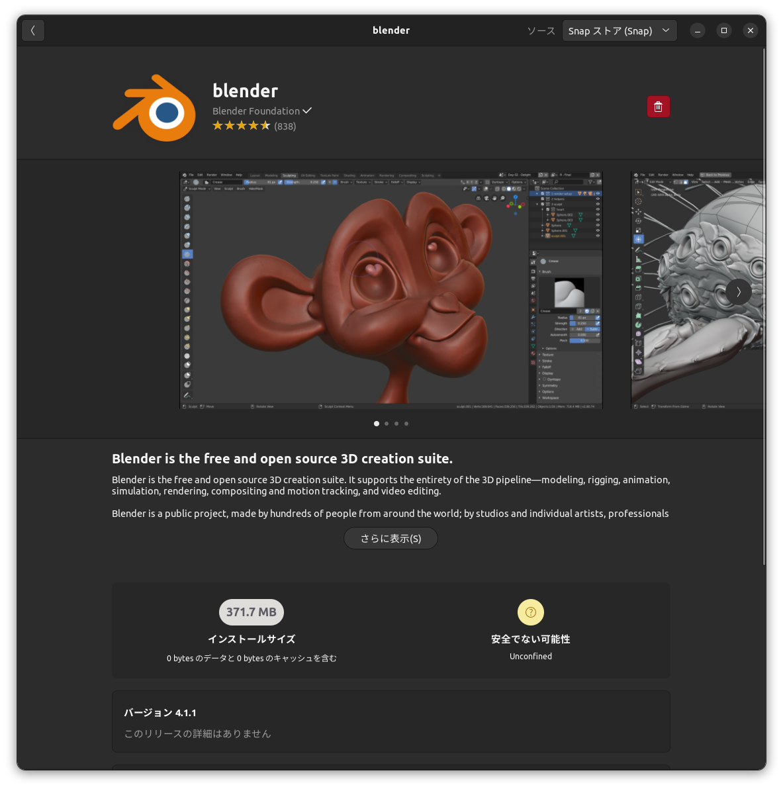


<!-- ## 前提知識
Linux システムでは、ユーザーのセッションが開始される際に複数の設定ファイルが読み込まれます。これらのファイルは、ユーザー環境の設定やシェルの振る舞いをカスタマイズするために使用されます。ここでは、一般的な設定ファイルである .xprofile, .bashrc, .bash_profile について説明します。

### 各設定ファイルの役割
#### `.bashrc`
- エイリアスの設定
- 端末の表示カスタマイズ
- 環境変数の設定
- 仮想端末を開く際には必ず読み込まれる
- 仮想端末から呼び出されたGUIアプリケーションであればここに書かれた環境変数を引き継ぐが、**デスクトップ環境から直接起動されたアプリケーションには影響しないことに注意。**
#### `.bash_profile`
- Bashシェルがログインシェルとして起動する際、読み込まれる設定ファイル。
- ログインセッションの初期化（パスの設定、環境変数のエクスポートなど）
- `.bashrc`を呼び出す
- ログインセッション、非ログインセッションの両者で共通の設定を行う
#### `.xprofile`
- Xセッションの起動時に読み込まれる設定ファイル
- guiアプリケーションの環境変数などを設定する
- `GTK_IM_MODULE`や`QT_IM_MODULE`などの入力メソッドの環境変数を設定するのに使われることがある

### `~/.config/environment.d/***.conf`
- 新しい形式の環境設定ファイル
- `systemd`か管理するユーザーセッションの一部としてロードされ、環境変数などを設定することが可能。
- `systemd`はこのファイル形式を使用して、ログイン時の環境変数を設定する
- この方式は`systemd`を使用するような新し目のバージョンで普及しつつある（Ubuntu 22.04では採用していない）
- 特定のシェルやログイン方法に依存しない汎用的な方法
  `.bashrc`, `.bash_profile`, `.xprofile`はBashだし、`.xprofile`はXセッションだし、という感じ。 -->

<!-- ### iBus
[wikipedia](https://ja.wikipedia.org/wiki/IBus)
> IBus（アイバス、Intelligent Input Bus）はUnix系オペレーティングシステム (OS) におけるインプットメソッドフレームワークである。IBusのBusはバスのような構造を持つところから来ている。

### Snap, Flatpakにおける日本語入力 -->
<!-- #### Snapにおける日本語入力の背景
- Snapアプリケーションは基本的にホストシステムの環境変数や設定を直接引き継ぐことができない。ゆえに、`GTK_IM_MODULE`, `QT_IM_MODULE`, `XMODIFIERS`などの環境変数や設定を反映させることができない。そのため、これらの設定は明示的にSnap内で設定する必要がある。
- 開発者が日本語入力をサポートするために必要なライブラリをパッケージに含めている必要がある。
- ユーザーとしては、Snapアプリケーションが期待する入力メソッドと整合性を持つようにシステムを調整する必要が求められる。
##### Snapアプリケーションの日本語入力の設定
###### 前提
開発者がSnapcraft.yamlファイルに必要な環境変数（`GTK_IM_MODULE`, `QT_IM_MODULE`, `XMODIFIERS`など）を定義していること
###### プラグの利用
プラグとは、Snapアプリケーションにおいてシステムリソースへのアクセスを制御するための接続点。
日本語入力を行う場合、`desktop`および`desktop-legacy`プラグをアプリケーションに追加し、これを`Snapcraft.yamlファイル`で指定している必要がある。
逆に言えば、開発者がこれらの設定をSnapアプリケーションに適用していれば、ユーザーがインストール後に特別な設定を行わずとも日本語入力を使用できる。
- プラグ(Plug)
  - Snapアプリケーションがシステムリソースなどに接続するための、「要求側」のエンドポイントのこと。
  - Snapアプリケーションは、各々プラグを通じてシステムの機能やデータへのアクセスを要求する
  - 例：ネットワークアクセス、オーディオ出力、プリンターへのアクセスなど。
- スロット(Slot)
  - システムや他のSnapアプリケーションが提供する「提供側」のエンドポイント。
  - システム自体やいろいろなSnapアプリケーションがこの機能を通じて、異なるアプリケーション間で機能を共有することがある
通常多くのSnapアプリケーションはインストール時に基本的なプラグとスロットの接続を自動的に行う。
これはSnapcraft.yamlに定義されている`auto-connect`プロパティによるもの。
ユーザーによる手動接続には`snap connect`コマンドを利用する。
Snap Store, Software CenterなどでSnapアプリケーション個々の権限管理を行うこともできる。
また、一部のSnapアプリケーションでは特定のリソースへのアクセスを要求する際、動的にダイアログを表示するものもある。これはSnapの標準的な挙動ではなく、開発者が独自に実装する場合のみ。

###### Snapアプリケーションの接続情報の確認方法
```bash
snap connections [snap-name]
```
指定したSnapアプリケーションのすべてのプラグとスロットの接続状況を表示する
Snap Storeで記述されている場合もある
```bash
$ snap connections kdenlive
Interface                                 Plug                                  Slot                                                          Notes
audio-playback                            kdenlive:audio-playback               :audio-playback                                               -
audio-record                              kdenlive:audio-record                 :audio-record                                                 -
content[icon-themes]                      kdenlive:icon-themes                  gtk-common-themes:icon-themes                                 -
content[kf5-5-111-qt-5-15-11-core22-all]  kdenlive:kf5-5-111-qt-5-15-11-core22  kf5-5-111-qt-5-15-11-core22:kf5-5-111-qt-5-15-11-core22-slot  -
content[sound-themes]                     kdenlive:sound-themes                 gtk-common-themes:sound-themes                                -
dbus                                      -                                     kdenlive:session-dbus-interface                               -
desktop                                   kdenlive:desktop                      :desktop                                                      -
desktop-legacy                            kdenlive:desktop-legacy               :desktop-legacy                                               -
home                                      kdenlive:home                         :home                                                         -
network                                   kdenlive:network                      :network                                                      -
network-bind                              kdenlive:network-bind                 :network-bind                                                 -
opengl                                    kdenlive:opengl                       :opengl                                                       -
removable-media                           kdenlive:removable-media              :removable-media                                              -
system-observe                            kdenlive:system-observe               :system-observe                                               -
wayland                                   kdenlive:wayland                      :wayland                                                      -
x11                                       kdenlive:x11                          :x11                                                          -
$ 
```

#### Flatpakにおける日本語入力の背景
- ユーザーはFlatpakアプリケーションのポータルを通じて、システムの入力メソッドにアクセスする許可設定を行う必要がある。
- Flatpakアプリケーションは基本的に`freedesktop.org`ランタイムや`KDE`, `GNOME`ランタイムを使用している。これらランタイムは一般的に入力メソッドライブラリを含んでいる
##### Flatpakのポータルとは
Flatpakアプリケーションがサンドボックス外のシステムリソースに安全にアクセスするためのしくみ。
ポータルを使用することによって、Flatpakアプリケーションはセキュリティを担保したまま以下の機能を得ることができる
- ファイルアクセス
- プリンターなどのデバイスへのアクセス
- 入力メソッドフレームワークへのアクセス

###### Flatpakにおけるアプリケーションの権限の確認と管理
```bash
flatpak override --user --device=all [application-id]
``` -->


<!-- ## そもそもの修正動機

システムインストールをした時、プレインストールされるインプットメソッドはibusです。
しかしわたしはシステムインストール時にfcitxを導入しました。

１．ibusとfcitxはそれぞれどのような機能があるのか
２．ibusがインストールされている状況がデフォルトなのは、どのような経緯があるからか。
３．ibusがインストールされている状況でfcitxを導入することのデメリットはなにか（競合など）
４．ibusとfcitxを比較して、それぞれの長所と短所をリストアップしたい

上記を解説してください。

以下は、ibusとfcitxの機能、歴史的背景、それぞれの長所と短所についての解説です。


### 3. ibusがインストールされている状況でfcitxを導入するデメリット

- **環境変数の競合**: 両方のインプットメソッドが同時に動作することで、環境変数（例えば `GTK_IM_MODULE` や `QT_IM_MODULE`）の設定が競合し、予期せぬ動作が起こる可能性があります。
- **リソースの消費**: 同時に複数のインプットメソッドを動かすと、システムリソース（CPU、メモリ）を無駄に消費することになります。
- **設定の複雑化**: ユーザーがどのインプットメソッドを使用しているか把握しにくくなり、トラブルシューティングが難しくなることがあります。 -->

<!-- ### 4. ibusとfcitxの比較

**長所:**

- **ibusの長所**:
  - GNOMEなどのデスクトップ環境との良好な統合。
  - 安定性と広範なディストリビューションサポート。
  - ユーザーフレンドリーな設定と管理。

- **fcitxの長所**:
  - 高いカスタマイズ性と機能性。
  - 東アジア言語への優れたサポート。
  - 軽量で、高速な

起動と動作。

**短所:**

- **ibusの短所**:
  - 時としてバグが見られることがある。
  - 一部の言語や特殊な入力メソッドでは、fcitxよりも劣る場合がある。

- **fcitxの短所**:
  - 初期設定が複雑であり、新しいユーザーにはやや敷居が高い。
  - GNOMEなどの一部デスクトップ環境との統合が完全でない場合がある。

これらの情報を参考に、ご自身のニーズに最も適したインプットメソッドを選択することができます。

## fcitxのカスタマイズ性
具体的なカスタマイズオプションを以下にリストアップします。

### 1. 多様な入力メソッドのサポート
- **広範囲な言語サポート**: fcitxは日本語（Mozc、Anthy）、中国語（Pinyin、Wubi）、韓国語（Hangul）、その他多数の言語に対応しており、簡単に切り替えが可能です。
- **多言語混在入力**: 異なる言語間での切り替えがスムーズで、一つの文中に複数の言語を混在させることが容易です。

### 2. 豊富なカスタマイズオプション
- **キーボードショートカット**: 入力メソッドの切り替えや特定の機能のトリガーに対して、ユーザーが自由にキーボードショートカットを設定できます。
- **スキンとテーマ**: インターフェースの外観をカスタマイズするための多くのスキンやテーマが用意されており、見た目を自分好みに変更することができます。

### 3. ユーザーインターフェースのカスタマイズ
- **候補ウィンドウの位置とサイズ**: 候補ウィンドウの表示位置やサイズをユーザーが指定でき、自分の入力環境に合わせた調整が可能です。
- **フォントと色**: 文字のフォントや色を変更することで、入力中の視認性を向上させることができます。

### 4. 拡張機能とプラグイン
- **追加機能のインストール**: fcitxはプラグインアーキテクチャを採用しており、ユーザーが必要に応じて機能を追加できます。例えば、追加の辞書や入力助け、他のアプリケーションとの連携機能などがあります。
- **プログラム可能なマクロ**: 特定のキーシーケンスに対してプリセットされたテキストを挿入するマクロを設定でき、効率的な入力が可能になります。

これらのカスタマイズ性の高さにより、fcitxは特に多機能性や個人の好みに合わせた細かい設定を求めるユーザーにとって魅力的な選択肢となります。 -->


<!-- ## 修正方針
問題を整理し、システムの運用方法を見直すのは良い考えですね。特に、複数の入力メソッドフレームワークが同時に動作している場合、競合や設定の誤りが原因で問題が発生することがあります。ここからどのように進めるか、具体的なステップを提案します。

### 1. 現状の確認
- 使用している入力フレームワーク（IBusとFcitx）の現在の設定と動作状態を確認します。
- `.bashrc` や他の設定ファイルの内容を見直し、環境変数などが正しく設定されているかチェックします。

### 2. 競合の解決
- システムで一つの入力フレームワークのみを有効にするよう設定します。お好みでFcitxを使用する場合、IBusを無効化することを検討します。
- Snapやその他のアプリケーションで日本語入力が機能していない原因を特定し、修正します。

### 3. 設定の整理
- 不要な設定や冗長な環境変数の削除を行います。
- `.bashrc` などの設定ファイルを整理し、必要な環境設定のみを明確に記述します。

### 4. テストと評価
- 変更した設定でシステムが正しく動作するかテストします。
- 特に日本語入力の動作を各アプリケーションで確認し、問題が解決されているかを評価します。 -->


<!-- ## `xdg-desktop-portal`について。
### `xdg`
XDGは「X Desktop Group」の略で、後に「freedesktop.org」と改名.
`xdg-desktop-portal` は、サンドボックス化されたアプリケーション（例えばFlatpakやSnapパッケージ）が、セキュリティ制約を保ちつつホストシステムのリソースやサービス（ファイルアクセス、カメラ、位置情報サービスなど）にアクセスできるようにするためのバックエンドサービス。
これらはデスクトップ環境に依存しない実装となっているが、たとえば`xdg-desktop-portal-gnome`や`xdg-desktop-portal-kde`などは、それぞれのデスクトップ環境にあわせたUIも同時に提供する。
たとえば自分がGNOME環境を使っていてKDEアプリケーションを使う場合、xdg-desktop-portal-gnomeにより、ダイアログなどのUIをGNOMEに馴染んだ表示にしてくれる。
ただし、アプリケーションがxdg-desktop-portalのAPIを通じてシステムリソースへアクセスするように作られている場合に限り、すべてのKDEアプリケーションがGNOME環境で完全に統一されたUIを提供するわけではない。

### GNOME環境で、`xdg-desktop-portal-kde`は必要か？
必要ない。
通常、xdg-desktop-portal-gnome や xdg-desktop-portal-kde は、それぞれGNOMEとKDEのデスクトップ環境向けに特化した実装を提供する -->
<!-- 
## 参考文献
- [WaylandとGNOME環境でfcitx5 + mozcがサードパーティアプリで機能しない問題を解決する方法](https://zenn.dev/moxak/articles/b1e7792be705ed)
- [KDE PlasmaでMozcなどIM使うなら・・ 環境変数を書いちゃダメ。自動起動に入れてもダメ。 というおはなし。](https://zenn.dev/armcore/articles/87398d56d5b64b)
- [IBus_archwiki](https://wiki.archlinux.jp/index.php/IBus#.E3.82.A4.E3.83.B3.E3.82.B9.E3.83.88.E3.83.BC.E3.83.AB)
- [Fcitx_archwiki](https://wiki.archlinux.jp/index.php/Fcitx#.E8.A8.AD.E5.AE.9A.E3.83.84.E3.83.BC.E3.83.AB) -->
